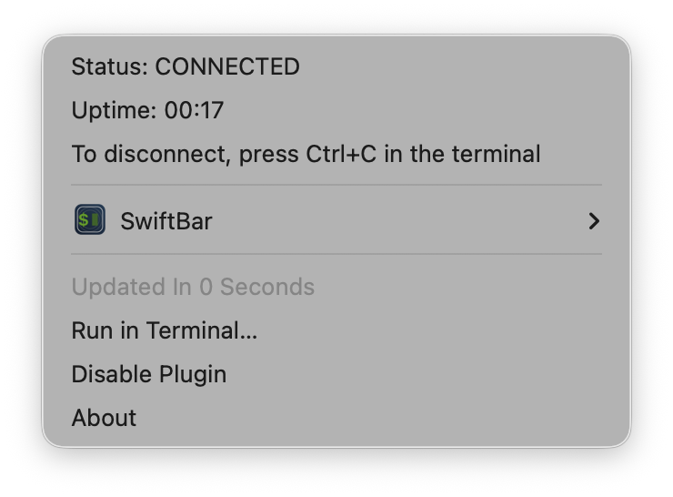

# macOS OpenConnect Split Tunnel

A configurable macOS wrapper around [OpenConnect](https://www.infradead.org/openconnect/) that automates browser-based Cisco VPN SSO, applies an explicit route allowlist, configures split DNS and validates the final network state.

It provides:
- browser-based Cisco VPN SSO;
- selective routing instead of accepting every route pushed by the VPN;
- split DNS for corporate domains;
- automatic route and DNS cleanup;
- validation of the resulting routing and split-DNS setup.

The project started as a small workaround and gradually evolved into a complete VPN automation tool.

## Background

At work, I needed to connect to a corporate Cisco AnyConnect VPN from macOS.
The standard Cisco client worked, but it installed many routes that were unrelated to the services I actually needed. As a result, a significant amount of normal traffic was sent through the corporate VPN.
After discussing the issue with the infrastructure team, I received approval to use OpenConnect as an alternative client.

The initial plan was simple:
1. connect using OpenConnect;
2. remove unnecessary routes;
3. keep only the required internal networks.

Then a few additional problems appeared:
- authentication required browser-based SSO;
- the VPN DNS server was applied globally;
- corporate DNS still had to work for selected domains;
- routes pushed by the VPN appeared asynchronously;
- cleanup had to work correctly after long-running sessions;
- macOS represented some routes differently from their original CIDR notation;
- partial failures could leave stale routes or resolver files behind.

What started as a small shell wrapper eventually became this script.

## Features

### Browser-based SSO

The script launches Google Chrome with a dedicated profile and enables the Chrome DevTools Protocol on localhost.
A small Playwright script connects to Chrome, waits for successful SSO authentication and extracts the configured VPN session cookie.
The cookie is then passed to OpenConnect.

### Selective VPN routing

OpenConnect and `vpnc-script` initially install the routes pushed by the VPN server.
The script then:
1. detects the active VPN gateway;
2. waits for route setup to finish;
3. collects all routes using that gateway;
4. removes every route that is not explicitly allowed;
5. adds any required routes that were not pushed by the server;
6. validates the final routing table.

Normal internet traffic continues to use the default macOS network interface.

Allowed networks are configured as an array, so adding another network does not require changes to the main script.

### Split DNS

The standard `vpnc-script` may configure the corporate DNS server globally.

This project uses a wrapper around `vpnc-script` that removes the DNS-related environment variables before running the original script:
```sh
unset INTERNAL_IP4_DNS
unset INTERNAL_IP6_DNS
unset CISCO_SPLIT_DNS
unset CISCO_DEF_DOMAIN
```

The script then creates domain-specific files in `/etc/resolver`.
For example:
```text
/etc/resolver/corp.example.com
```

This allows corporate domains to use the VPN DNS server while all other DNS queries continue using the DNS configuration of the current network.

### Automatic cleanup

On exit, including `Ctrl+C`, normal termination and most handled failures, the script:
- stops the log follower;
- removes routes added by the script;
- stops OpenConnect;
- removes split-DNS resolver files;
- flushes the macOS DNS cache;
- stops the `sudo` keepalive process;
- removes temporary files.

Cleanup operations are intentionally tolerant of partial failures.

### Runtime validation

Before reporting a successful connection, the script verifies that:
- every configured network uses the VPN gateway;
- the optional standalone host uses the VPN gateway, when configured;
- the corporate DNS server is routed through the VPN gateway;
- no unexpected routes remain through the VPN gateway.

If the resulting routing table does not match the configured policy, the script stops instead of silently continuing with an incorrect network configuration.

## Project structure

```text
.
├── connect.sh
├── config.example.sh
├── swiftbar/
│   └── openconnect-vpn.5s.sh
├── .gitignore
└── README.md
```

`connect.sh` contains the VPN automation logic.

`config.example.sh` contains safe example values and documents the available configuration options.

The real `config.sh` is excluded from Git because it may contain internal hosts, networks, DNS servers and domains.

## Requirements

The script is intended for macOS.

Required software:
- Bash;
- Google Chrome;
- Node.js and npm;
- Playwright;
- OpenConnect;
- `vpnc-script`.

Install OpenConnect with Homebrew:
```bash
brew install openconnect
```

Install Playwright globally:
```bash
npm install -g playwright
```

The script searches for `vpnc-script` in:
```text
/opt/homebrew/etc/vpnc/vpnc-script
/usr/local/etc/vpnc/vpnc-script
/etc/vpnc/vpnc-script
```

## Setup

Clone the repository:
```bash
git clone https://github.com/vkirkizh/macos-openconnect-split-tunnel.git
cd macos-openconnect-split-tunnel
```

Create a local configuration:
```bash
cp config.example.sh config.sh
chmod 600 config.sh
```

Edit `config.sh` and replace the example values.

Make the script executable:
```bash
chmod +x connect.sh
```

Run it:
```bash
./connect.sh
```

A dedicated Chrome window will open for authentication.

After successful SSO:
- the authentication cookie is extracted;
- Chrome is closed;
- OpenConnect starts;
- routes are filtered;
- split DNS is configured;
- the final network state is validated.

Press `Ctrl+C` to disconnect.

## Configuration

Example:

```bash
#!/bin/bash

CHROME_BIN="/Applications/Google Chrome.app/Contents/MacOS/Google Chrome"
CHROME_PROFILE_DIR="${HOME}/.local/share/openconnect-sso-chrome"

CDP_PORT="9222"

VPN_HOST="vpn.example.com"
COOKIE_NAME="webvpn"

VPN_ALLOWED_HOST=""

VPN_CORPORATE_DNS="10.40.0.1"

VPN_ALLOWED_NETWORKS=(
  "10.20.30.0/24|10.20.30/24|10.20.30.1"
  "10.40.0.0/16|10.40/16|10.40.0.10"
)

VPN_GATEWAY_REGEX='^10\.50\.[0-9]+\.[0-9]+$'

CORPORATE_DNS_DOMAINS=(
  "corp.example.com"
  "internal.example.net"
)

VPN_ROUTE_SETUP_DELAY_SECONDS="3"
```

### Optional standalone host

`VPN_ALLOWED_HOST` is an optional host route that is expected to be pushed by the VPN server.
The script preserves and validates the route, but does not create it.

Leave it empty if no standalone host route is required:
```bash
VPN_ALLOWED_HOST=""
```

Example:
```bash
VPN_ALLOWED_HOST="203.0.113.10"
```

### Allowed network entries

Each item in `VPN_ALLOWED_NETWORKS` has three fields separated by `|`:
```text
canonical-CIDR|netstat-route|test-IP
```

Example:
```bash
"10.40.0.0/16|10.40/16|10.40.0.10"
```

The fields are used as follows:
- `10.40.0.0/16` is passed to `route add` and `route delete`;
- `10.40/16` is matched against the route shown by `netstat`;
- `10.40.0.10` is used to verify that the final route points to the VPN gateway.

Spaces are not allowed inside an entry.

macOS may abbreviate routes in `netstat` output. For example:
```text
10.40.0.0/16
```

may appear as:
```text
10.40/16
```

Use the exact value printed by `netstat` in the second field.

### Gateway detection

`VPN_GATEWAY_REGEX` is used to identify the VPN gateway in the macOS routing table:
```bash
VPN_GATEWAY_REGEX='^10\.50\.[0-9]+\.[0-9]+$'
```

It must match the address pool used by the VPN.

### Test addresses

Each test IP must belong to its corresponding allowed network.
The address does not need to respond to ICMP or expose any service.
The script only uses `route -n get` to verify which gateway macOS selects for it.

### Corporate DNS route

`VPN_CORPORATE_DNS` must be covered by one of the entries in `VPN_ALLOWED_NETWORKS`.

Otherwise the script will stop during final validation because the DNS server is not routed through the VPN gateway.

## Verifying the connection

Inspect the routing table:
```bash
netstat -rn -f inet
```

Check an internal address:
```bash
route -n get 10.40.0.10
```

The result should reference the VPN gateway and a `utun` interface.

Check a normal internet address:
```bash
route -n get 8.8.8.8
```

The result should reference the normal default gateway and interface, usually `en0`.

Inspect the DNS configuration:
```bash
scutil --dns
```

Check a corporate hostname:
```bash
dscacheutil -q host -a name service.corp.example.com
```

## Optional SwiftBar integration

The repository includes an optional [SwiftBar](https://swiftbar.app/) plugin in:
```text
swiftbar/openconnect-vpn.5s.sh
```

The plugin displays the VPN connection status and session uptime in the macOS menu bar.
It can also launch `connect.sh` in a terminal window.



To use the plugin, follow the steps below.

Install SwiftBar with Homebrew:
```bash
brew install --cask swiftbar
```

From the repository root, make the plugin executable and create a symlink in the SwiftBar plugins directory:
```bash
chmod +x swiftbar/openconnect-vpn.5s.sh

ln -s \
  "$(pwd)/swiftbar/openconnect-vpn.5s.sh" \
  "$HOME/SwiftBar/openconnect-vpn.5s.sh"
```

The exact SwiftBar plugins directory depends on your local configuration.
Make sure SwiftBar is configured to use the directory containing the symlink.

The plugin reads `VPN_HOST` from the project's `config.sh` and detects the corresponding OpenConnect process.
Disconnect the VPN by pressing `Ctrl+C` in the terminal window running `connect.sh`.

## Design decisions

### Why not configure routes directly from the beginning?

The VPN server may push a large and changing set of routes.

Allowing `vpnc-script` to perform its normal setup first makes the script less dependent on the full server-side route configuration. The script then applies a local allowlist policy to the resulting routing table.

### Why use `/etc/resolver`?

macOS supports domain-specific DNS resolvers through files in `/etc/resolver`.

This provides native split DNS without replacing the DNS servers configured for Wi-Fi, Ethernet or another active connection.

### Why use a dedicated Chrome profile?

A dedicated profile isolates the VPN authentication session from the user's normal browser profile and makes the SSO flow more predictable.

### Why keep the sudo timestamp alive?

VPN sessions may last for many hours.

Cleanup requires elevated privileges to remove routes and resolver files. A small background process refreshes the sudo timestamp so cleanup does not unexpectedly ask for a password when the VPN session ends.

## Security considerations

- Never commit the real `config.sh`.
- Treat the dedicated Chrome profile as sensitive.
- Do not publish real corporate hostnames, internal IP ranges, DNS servers or domains without authorization.
- The Chrome debugging endpoint is bound only to `127.0.0.1`.
- The VPN cookie is passed to OpenConnect as a command-line argument and may briefly be visible to other local processes with sufficient privileges.
- Review your organization's security policy before replacing or automating its official VPN client.

## Limitations

- macOS only;
- designed for one active instance at a time;
- assumes a Cisco-compatible SSO page and cookie-based OpenConnect authentication;
- supports multiple allowed networks through configuration, but only one standalone allowed host;
- assumes that the tunnel interface network appears in the routing table as the VPN gateway's /24 network;
- route setup uses a configurable delay because `vpnc-script` may still be adding routes after the tunnel appears;
- `SIGKILL`, system crashes and power loss prevent shell cleanup from running;
- existing `/etc/resolver` files for configured domains are overwritten and removed;
- different VPN environments may require changes to gateway detection or the SSO URL.

## Engineering highlights

Although this is a Bash utility, it contains several concepts that are also important in backend development:
- configuration separation;
- explicit state management;
- defensive cleanup;
- signal handling;
- process lifecycle management;
- failure-safe operations;
- runtime invariants and validation;
- minimal network exposure through explicit route allowlisting;
- integration with external tools and operating-system APIs.

The script was developed iteratively against a real VPN environment, with routing and DNS behavior verified using macOS networking tools.

## Disclaimer

This project is not affiliated with Cisco or the OpenConnect project.

Use it at your own risk. Review the script and understand the routing and DNS changes before running it on your system.

## License

MIT

## Author

Valery Kirkizh

[valery@kirkizh.com](mailto:valery@kirkizh.com)
